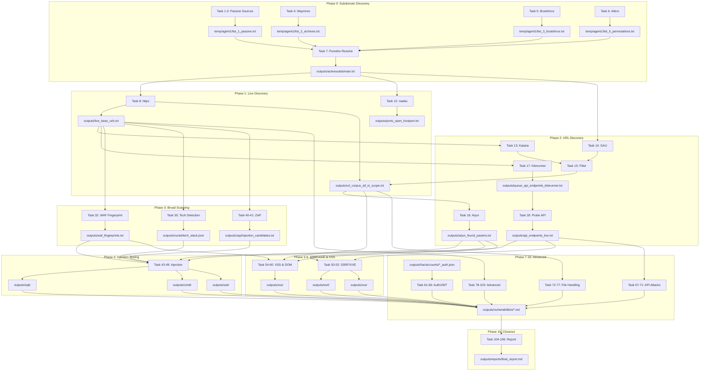

# Recon Workflow Mindmap (106 Tasks — Full Attack Pipeline)

This file includes:
1) A mindmap listing each task with its main inputs/outputs
2) A flowchart that connects inputs → task → outputs with arrows

## Quick Reference — Key Files

| File | Producer | Consumers |
|------|----------|-----------|
| outputs/activesubdomain.txt | Task 7 | Tasks 8, 12, 14, 27, 89, 90 |
| outputs/live_base_urls.txt | Task 8 | Tasks 9, 13, 17, 32, 40+, all injection tasks |
| outputs/url_corpus_all_in_scope.txt | Task 8, 15 | Tasks 16, 54-60, 72-77 |
| outputs/waf_fingerprints.txt | Task 32 | Tasks 43-60 (all injection) |
| outputs/nuclei/tech_stack.json | Task 35 | Tasks 43-77 (tech-aware exploitation) |
| outputs/har/accounts/*_auth.json | Task 29 | Tasks 33-34, 61-80 (auth-required) |

```mermaid
mindmap
  root((Security Testing Pipeline — 106 Tasks))
    Conventions
      outputs/ => final artifacts
      temp/agent1/ => intermediates
      manual/ => manual inputs
      task/taskN/ => run-cards
    Phase_0_Subdomain_Discovery
      Task_1_Subfinder
        input: domain
        output: temp/agent1/list_1_passive.txt
      Task_2_Amass
        input: domain
        output: temp/agent1/list_1_passive.txt
      Task_3_GitHub_Subdomains
        input: domain + token
        output: temp/agent1/list_1_passive.txt
      Task_4_Waymore
        input: domain
        output: temp/agent1/list_2_archives.txt
      Task_5_Bruteforce
        input: domain + wordlist + resolvers
        output: temp/agent1/list_3_bruteforce.txt
      Task_10_Hakrevdns_optional
        input: CIDRs
        output: temp/agent1/list_4_reverse.txt
      Task_6_Alterx
        input: temp/agent1/list_{1,2,3,4}*
        output: temp/agent1/list_5_permutations.txt
      Task_7_Puredns_Resolve
        input: all list_* files + resolvers
        output: outputs/activesubdomain.txt
      Task_11_Dnsx
        input: candidates_all.txt
        output: temp/agent1/resolved_dnsx.txt
    Phase_1_Live_Discovery
      Task_8_Httpx
        input: outputs/activesubdomain.txt
        output: outputs/live_base_urls.txt
        output: outputs/url_corpus_all_in_scope.txt
      Task_12_Naabu
        input: outputs/activesubdomain.txt
        output: outputs/ports_open_hostport.txt
      Task_13_Httpx_Hostport_Katana
        input: outputs/ports_open_hostport.txt
        output: outputs/live_hostport_urls.txt
        output: outputs/katana_urls.txt
      Task_9_Knownfiles_API_Docs
        input: outputs/live_base_urls.txt
        output: outputs/api_docs_urls.txt
    Phase_2_URL_Discovery
      Task_14_GAU
        input: outputs/activesubdomain.txt
        output: outputs/gau_urls.txt
      Task_15_Allowlist_Filter
        input: gau + katana URLs
        output: outputs/url_corpus_all_in_scope.txt
      Task_16_Arjun
        input: outputs/url_corpus_all_in_scope.txt
        output: outputs/arjun_found_params.txt
      Task_17_Kiterunner
        input: outputs/live_base_urls.txt
        output: outputs/queue_api_endpoints_kiterunner.txt
      Task_18_Httpx_Probe_API
        input: outputs/queue_api_endpoints_kiterunner.txt
        output: outputs/api_endpoints_live.txt
      Task_19_22_JS_Pipeline
        input: URL corpora
        output: outputs/js_urls_live.txt
        output: outputs/js_endpoints_from_js.txt
    Phase_3_Broad_Scanning
      Task_23_Nuclei
        output: outputs/nuclei_findings.txt
      Task_24_Gowitness
        output: outputs/gowitness/
      Task_25_Ffuf
        output: outputs/ffuf_findings.txt
      Task_26_Nmap
        output: outputs/nmap/
      Task_27_Subjack
        output: outputs/coverage_takeover_candidates_subjack.txt
      Task_29_HAR_Analysis
        input: manual/har/*.har
        output: outputs/har/accounts/*_auth.json
        output: outputs/har/common_data.txt
      Task_30_Tlsx
        output: outputs/coverage_tls_sans_in_scope.txt
      Task_31_Playwright
        output: temp/agent1/playwright_har/
      Task_32_WAF_Fingerprinting
        input: outputs/live_base_urls.txt
        output: outputs/waf_fingerprints.txt
        note: RUN BEFORE injection testing
      Task_33_34_Access_Control
        input: outputs/har/accounts/*_auth.json
        output: outputs/access_control_findings.json
        output: outputs/idor_findings.json
      Task_35_39_Nuclei_Intelligence
        output: outputs/nuclei/tech_stack.json
        output: outputs/nuclei/exposures.txt
        output: outputs/nuclei/cves_high.txt
      Task_40_41_ZAP
        output: outputs/zap/injection_candidates.txt
      Task_42_Source_Extraction
        output: outputs/source/secrets_found.txt
    Phase_4_Injection_Testing
      Task_43_Ghauri_SQLi
        input: injection_candidates + WAF + tech_stack
        output: outputs/sqli/ghauri_vulnerable.txt
        output: outputs/sqli/sqlmap_priority_targets.json
      Task_44_SQLMap_Deep
        input: outputs/sqli/sqlmap_priority_targets.json
        output: outputs/sqli/sqlmap_dumps/
        note: DUMP EVERYTHING
      Task_45_NoSQLMap
        output: outputs/sqli/nosql_vulnerable.txt
      Task_46_47_CMDi
        output: outputs/cmdi/commix_vulnerable.txt
        output: outputs/cmdi/oob_vulnerable.txt
      Task_48_SSTI
        output: outputs/ssti/ssti_vulnerable.txt
      Task_49_LDAP_XPath
        output: outputs/ldap_xpath/
    Phase_5_SSRF_XXE
      Task_50_51_SSRF
        input: outputs/interactsh_id.txt
        output: outputs/ssrf/ssrf_confirmed.txt
      Task_52_53_XXE
        output: outputs/xxe/xxe_confirmed.txt
    Phase_6_Client_Side
      Task_54_XSS_Reflection
        input: outputs/queue_dynamic_endpoints_urls.txt
        input: outputs/waf_fingerprints.txt
        output: outputs/xss_reflections_kxss.txt
        output: outputs/xss_confirmed_dalfox.txt
      Task_55_XSS_Deep
        output: outputs/xss/reflected_xss.txt
        output: outputs/xss/stored_xss.txt
      Task_56_Blind_XSS
        input: outputs/interactsh_id.txt
        output: outputs/xss/blind_xss_triggered.txt
      Task_57_Prototype_Pollution
        input: outputs/js_urls_live.txt
        output: outputs/prototype_pollution/
      Task_58_DOM_Clobbering
        output: outputs/dom_clobbering/
      Task_59_CSS_Injection
        output: outputs/css_injection/
      Task_60_Dangling_Markup
        output: outputs/dangling_markup/
    Phase_7_Auth_Session
      Task_61_JWT_Attacks
        input: outputs/har/accounts/*_auth.json
        output: outputs/jwt/jwt_vulnerable.txt
      Task_62_OAuth_SSO
        output: outputs/oauth/redirect_bypass.txt
      Task_63_64_Session
        output: outputs/session/fixation.txt
      Task_65_2FA_Bypass
        output: outputs/2fa/bypass_methods.txt
      Task_66_Password_Reset
        output: outputs/reset/host_injection.txt
    Phase_8_API_Attacks
      Task_67_69_GraphQL
        output: outputs/graphql/introspection_raw.json
        output: outputs/graphql/batching_dos.txt
      Task_70_REST_Fuzzing
        output: outputs/rest/mass_assignment.txt
      Task_71_Rate_Limit_Bypass
        output: outputs/ratelimit/bypass_methods.txt
    Phase_9_File_Handling
      Task_72_LFI_Detection
        input: outputs/url_corpus_all_in_scope.txt
        output: outputs/lfi/lfi_confirmed.txt
        output: temp/agent1/queue_lfi_exploitation.txt
      Task_73_LFI_to_RCE
        input: outputs/lfi/lfi_confirmed.txt
        output: outputs/lfi/rce_confirmed.txt
      Task_74_Upload_Detection
        output: outputs/upload/upload_endpoints.txt
        output: temp/agent1/queue_upload_exploitation.txt
      Task_75_Upload_Exploitation
        output: outputs/upload/svg_xss_results.txt
        output: outputs/upload/imagetragick_results.txt
      Task_76_Deser_Detection
        output: outputs/deser/*_candidates.txt
        output: temp/agent1/queue_deser_exploitation.txt
      Task_77_Deser_RCE
        input: temp/agent1/queue_deser_exploitation.txt
        output: outputs/deser/java_rce_confirmed.txt
    Phase_10_Business_Logic
      Task_78_Race_Conditions
        output: outputs/race/race_vulnerable.txt
      Task_79_Payment_Logic
        output: outputs/payment/
      Task_80_Business_Logic
        output: outputs/business_logic/
    Phase_11_HTTP_Protocol
      Task_81_Request_Smuggling
        output: outputs/smuggling/
      Task_82_HTTP2_Attacks
        output: outputs/http2/
      Task_83_Browser_Desync
        output: outputs/desync/
    Phase_12_Cache_CDN
      Task_84_Cache_Poisoning
        output: outputs/cache/poison_confirmed.txt
      Task_85_Cache_Deception
        output: outputs/cache/deception_vulnerable.txt
      Task_86_ESI_Injection
        output: outputs/esi/
    Phase_13_Infrastructure
      Task_87_Cloud_Metadata_SSRF
        input: outputs/ssrf/ssrf_confirmed.txt
        output: outputs/cloud/iam_credentials.txt
      Task_88_Cloud_Bucket_Abuse
        output: outputs/cloud/buckets_public_write.txt
      Task_89_Subdomain_Takeover
        output: outputs/takeover/
      Task_90_DNS_Zone_Attacks
        output: outputs/dns/
    Phase_14_Supply_Chain
      Task_91_Dependency_Confusion
        output: outputs/supply_chain/
      Task_92_Second_Order_Attacks
        output: outputs/second_order/
    Phase_15_Misc_Advanced
      Task_93_CORS
        output: outputs/cors/
      Task_94_Clickjacking
        output: outputs/clickjacking/
      Task_95_CSP_Bypass
        output: outputs/csp/
      Task_96_Host_Header
        output: outputs/host_header/
      Task_97_Open_Redirect
        output: outputs/openredirect/
      Task_98_Verb_Tampering
        output: outputs/verb_tampering/
      Task_99_Rate_Limiting
        output: outputs/ratelimit/
      Task_100_Session_Management
        output: outputs/session/
      Task_101_Business_Logic
        output: outputs/business_logic/
      Task_102_GraphQL_Attacks
        output: outputs/graphql/
      Task_103_WebSocket
        output: outputs/websocket/
    Phase_16_Closeout
      Task_104_Vulnerability_Consolidation
        input: outputs/vulnerabilities/*.md
        output: outputs/reports/vulnerability_consolidation.md
      Task_105_Final_Report
        output: outputs/reports/final_report.md
      Task_106_Evidence_Closeout
        output: outputs/final_delivery/
```

## Simplified Flowchart — Key Data Flows



## Notes
- Mermaid rendering depends on your Markdown preview setup
- This flowchart shows key data flows between phases
- Individual task run-cards in `task/taskN/` have full input/output details
- All vulnerabilities consolidate to `outputs/vulnerabilities/*.md`
- Final report generated by Task 106
